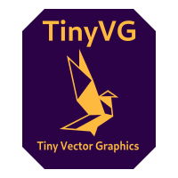
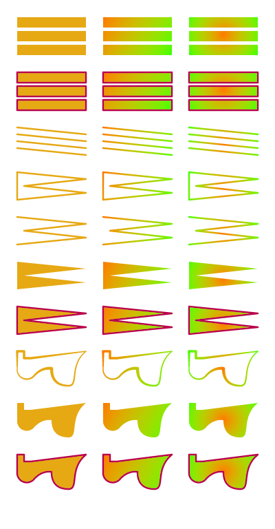

# `.tvg`: Tiny Vector Graphics

 A new format for simple vector graphics.

## Why?

Quoting the german Wikipedia on SVG:

> Praktisch alle relevanten Webbrowser können einen Großteil des Sprachumfangs darstellen.

Translated:

> Virtually all relevant web browsers can display most of the language specification.

SVG is a horribly complex format, allowing the embedding of JavaScript and other features no sane person ever wants to have in their images. Other relevant vector graphics formats do not exist or don't have a documentation or specification (looking at you, [HVIF](https://en.wikipedia.org/wiki/Haiku_Vector_Icon_Format)!).

This project tries to create and specify a new vector format suitable for:

- Small and medium icons (think toolbar, buttons, …)
- Low complexity graphics (think graphs, diagrams, …)
- Embedded platforms (low resource requirements)

## Project Goals

Create a vector graphics format that fulfils the following requirements:

- Binary encoded ✅
- Small file size (must be smaller than equivalent bitmaps or SVG graphics) ✅
- Can be rendered without floating point support (suitable for embedded) ✅
- Can be rendered efficiently with modern GPUs (suitable for PC, games) ✅
- Supports the following drawing primitives:
  - points / circles ✅
  - lines ✅
  - triangles / polygons ✅
- Support drawing styles
  - filled ✅
  - outline ✅
  - filled with outline ✅
- Support
  - flat colors ✅
  - bitmap textures
  - linear gradients ✅
  - line widths ✅
- Can use hinting to allow really small rendering (16²)

## Use Cases

The use cases here are listed to be considered while working on the specification and give the project a shape and boundary:

- Application Icons (large, fine details)
- Toolbar Icons (small, simple)
- Graphs (large structure, no details, text, think [graphviz](https://graphviz.org/))
- Diagrams (colored surfaces, text, lines)
- Mangas/Comics (complex shapes, different line thickness)

## Project Status

This project is currently work-in-progress and there's only a reference implementation.

The specification is work-in-progress and incomplete right now, and the format itself needs some clean-ups and streamlining order of things in the format itself. After that, the specification will be created.

See the following documents:

- [Specification](documents/specification.md)
- [Textual Representation](documents/text-format.md)

See also this image to have a preview of what is already implemented:

### Milestones

- [x] Create prototype implementation
- [x] Finalize prototype
  - [x] Add smaller/bigger colors (16 bit, 30 bit)
  - [x] Add color space information (the color space is defined as sRGB)
  - [x] Add extended coordinate space (32 bit coordinates)
  - [x] Encode primary style in command, reduces command to 63 variants, allows bigger encoding
- [ ] Improve rendering
  - [x] Add anti-aliasing
  - [x] Add missing line width modifier for path rendering
  - [ ] Improve rendering performance
  - [x] Move anti-aliased rendering into core library
- [x] Implement textual representation
  - [x] Convert to `.tvg`
  - [x] Convert to text
  - [x] Format text
  - [x] Convert to SVG
- [x] Add auxiliary tools
  - [x] C Library frontend
  - [ ] Build SDK
    - [ ] Zig package
    - [ ] Native packages
      - [x] dynamic macOS x86_64, aarch64
      - [x] static macOS x86_64, aarch64
      - [ ] dynamic Windows x86_64 (TODO: Make two .lib files for dynamic and static)
      - [ ] static Windows x86_64 (TODO: See above)
      - [ ] dynamic Linux x86_64, aarch64, arm (TODO: Test on real devices)
      - [ ] static Linux x86_64, aarch64, arm (TODO: Test on real devices)
  - [x] Wasm Polyfill
- [ ] Improve website
  - [ ] Add manual to tools
  - [x] Add `tiger.tvg` example file
  - [x] Add `comic.tvg` example file
  - [x] Add `charts.tvg` example file (pie, line and bar chart)
  - [x] Add `app-icon.tvg` example file
  - [x] Add `graph.tvg` example file
  - [ ] Add text file spec/examples
  - [ ] Fix polyfill (change CI)
- [x] Benchmark Suite
  - [x] File Size (SVG vs. TinyVG)
  - [ ] Update final benchmark
- [x] Sort github issues
- [ ] Write specification
- [ ] Review specification
- [ ] Release!
- [ ] Lock the specification into _Version 1_.
- [ ] Future stuff
  - [ ] (Fill|Draw|Fill Outlined) Ellipse/Circle opcode
  - [ ] Smooth Bezier (via mirror behaviour)
  - [ ] Inkscape Plugin
  - [ ] library/sdk feature: convert TinyVG to draw lists/commands

### Future Tasks

- [ ] Convert from SVG (via external tool)
  - [ ] SVG `<ellipse>`

## Considerations

- Which color format does TinyVG use?
  - Linear color space?
  - sRGB?
- What is the default color depth?
  - 15/16 bit?
  - 24 bit?
  - 30 bit?
- How should font rendering work?
  - Embed vector fonts in the file?
    - Sparse font mapping: Only map glyphs actually used
  - Just render out text as path/line data?
  - SVG shows that not embedding a font makes the file completly unportable and will look different in every renderer. This needs to be prevented
  - Use UTF-8 encoding

## Resources

- [CSS Gradients](https://css-tricks.com/css3-gradients/)
  - Radial and conic gradients can be used for nice 3D shading
- Previous Work: [TurtleFont](https://github.com/MasterQ32/turtlefont) is a pure line-drawing vector format
- [SVG Path Editor](https://yqnn.github.io/svg-path-editor/), a tool to easily design or inspect SVG paths
